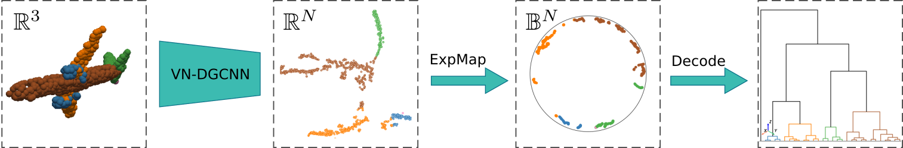

# Rotation-invariant Hierarchical Segmentation on Poincare Ball for 3D Point Cloud
## Abstract


---
Point clouds are a set of data points in space to represent the 3D geometry of objects. A fundamental step in the processing is to achieve segmentation of the point cloud at different levels of detail. Within this context, hierarchical clustering (HC) breaks the point cloud down into coherent subsets to recognize the parts that make up the object. Along with classic approaches that build a hierarchical tree bottom-up using linkage criteria, recent developments exploit the tree-likeness of hyperbolic metric space, embedding data into the Poincaré Ball and capturing a hierarchical structure with low distortion. The main advantage of this kind of solution is the possibility to explore the space of discrete binary trees using continuous optimization. However, in this framework, a similarity function between points is assumed to be known, while this cannot always be granted for point cloud applications. In our method, we propose to use metric learning to fit at the same time the good similarity function and the optimal embedding into the hyperbolic space. Furthermore, when arbitrary rotations are applied to a 3D object, the pose should not influence the segmentation quality. Therefore, to avoid extensive data augmentation, we impose rotation invariance to ensure the uniqueness of the hierarchical segmentation of point clouds. We show the performance of our method on two datasets, ShapeNet and PartNet, at different levels of granularity. The results obtained are promising when compared to state-of-the-art flat segmentation.



---


## Install conda environment
Use the following command to create an Anaconda environment containing all the dependecies
```
conda env create -f hpcs-env.yaml
```

---
## Fetch Data
### ShapeNet
Before training/testing models you need to download ShapeNet dataset from  [TODO: Add a link to shapenet].

Please use the following structure to organize data
```
    HPCS/
        ...
        data/
            ...
            ShapeNet/
                raw/
            ...
        ...
```

### PartNet
Similarly, download PartNet data from the following link [TODO: Add link]
and use the following structure for PartNet data
```
    HPCS/
        ...
        data/
            PartNet/
                after_merging_label_ids/
                ins_seg_h5/
                mergin_hierarchy_mapping/
                sem_seg_h5/
                train_val_test_split/
            ...
        ...
```

---
## Train

### Train on ShapeNet
```
bash run_train_shapenet.sh
```
or
```
python train.py --dataset 'shapenet' \
  --fixed_points 1024 \
  --model 'vn_dgcnn_partseg' \
  --eucl_embedding 32 \
  --hyp_embedding 32 \
  --k 20 \
  --margin 0.35 \
  --t_per_anchor 50 \
  --temperature 0.05 \
  --epochs 50 \
  --lr 0.05 \
  --accelerator 'gpu' \
  --trade_off 0.10
```
### Train on PartNet
To train on partnet, please choose one between the following categories:
- Bed
- Bottle
- Chair
- Clock
- Dishwasher
- Display
- Door
- Earphone
- Faucet
- Knife
- Lamp
- Microwave
- Refrigerator
- StorageFurniture
- Table
- TrashCan
- Vase

```
bash run_train_partnet.sh
```
or
```
python train.py --dataset 'partnet' \
  --fixed_points 1024 \
  --category 'Bed' \
  --level 3 \
  --model 'vn_dgcnn_partseg' \
  --eucl_embedding 32 \
  --hyp_embedding 32 \
  --k 20 \
  --margin 0.35 \
  --t_per_anchor 50 \
  --temperature 0.05 \
  --epochs 50 \
  --lr 0.05 \
  --accelerator 'gpu' \
  --trade_off 0.10
```

---
## Test
```
bash run_test_shapenet.sh
```
or
```
python train.py --dataset 'shapenet' \
  --fixed_points 1024 \
  --model 'vn_dgcnn_partseg' \
  --eucl_embedding 32 \
  --hyp_embedding 32 \
  --k 20 \
  --margin 0.35 \
  --t_per_anchor 50 \
  --temperature 0.05 \
  --epochs 50 \
  --lr 0.05 \
  --accelerator 'gpu' \
  --trade_off 0.10
```
## Test on ShapeNet

## Test on Partnet
To test on partnet, please choose one between the following categories:
- Bed
- Bottle
- Chair
- Clock
- Dishwasher
- Display
- Door
- Earphone
- Faucet
- Knife
- Lamp
- Microwave
- Refrigerator
- StorageFurniture
- Table
- TrashCan
- Vase

And choose between ``level`` from 1 to 3. 
```
bash run_test_partnet.sh
```
or
```
python train.py --dataset 'partnet' \
  --fixed_points 1024 \
  --category 'Bed' \
  --level 3 \
  --model 'vn_dgcnn_partseg' \
  --eucl_embedding 32 \
  --hyp_embedding 32 \
  --k 20 \
  --margin 0.35 \
  --t_per_anchor 50 \
  --temperature 0.05 \
  --epochs 50 \
  --lr 0.05 \
  --accelerator 'gpu' \
  --trade_off 0.10
```